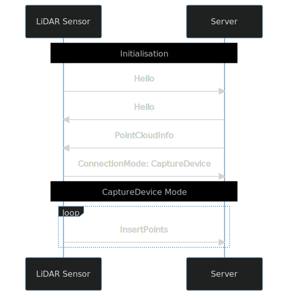
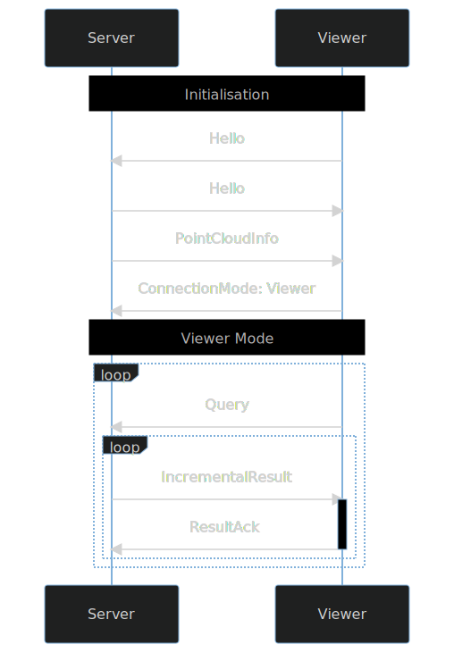

# Lidar Serv


## Building

The project is built with cargo:

```shell
cargo build --release --all
```

The project consists of several binaries. You can build and run specific binaries using the `--bin` argument. 
Make sure to always use release mode, as debug mode will usually be too slow.

Example: 

```shell
cargo run --release --bin lidarserv-server -- --help
```

Overview of the included binaries:

| Binary              | Description                                                              |
|---------------------|--------------------------------------------------------------------------|
| lidarserv-server    | The server                                                               |
| lidarserv-viewer    | Client that connects to the server and visualizes the served point cloud |
| velodyne-csv-replay | Simulates a LiDAR scanner that sends point data to the server            |
| evaluation          | Evaluation for the index data structures                                 |

If you are working with these tools a lot, it might be helpful to install them into your system
so that you don't have to repeat the full cargo command every time:

```shell
cargo install --path ./lidarserv-server
cargo install --path ./lidarserv-viewer
cargo install --path ./velodyne-csv-replay
cargo install --path ./evaluation
```

## Tutorial

### Create a new indexed point cloud

The lidar server is the main component, that manages the point cloud. Any point cloud project is started, by initializing a new index:

```shell
lidarserv-server init my-pointcloud
```

This will create a new empty point cloud in the folder `my-pointcloud`. Since we did not specify any additional parameters, the default settings will be used.

You can pass a few options to the init command to configure the point cloud indexer. In order to get a full list of the supported options, run `lidarserv-server init --help`.
The most important ones are:

| Option            | Description                                                   |
|-------------------|---------------------------------------------------------------|
| `--index mno`     | Uses the octree index structure for indexing the point cloud. |
| `--index bvg`     | Uses the sensor position index for indexing the point cloud.  |
| `--num-threads 4` | The number of threads to use for indexing.                    |

The options are stored in `my-pointcloud/settings.json`. You can change the options later by editing this file. 
However, note that not all options can be changed after the index has been created.

### Start the lidar server

After creating a point cloud, we can start the server like so:

```shell
lidarserv-server serve my-pointcloud
```

If needed, you can use the optional parameters `-h` and `-p` to bind to a specific host and port number. The default is to listen on `::1` (IPv6 loopback address), port `4567`.

### Insert points

The point cloud that is currently being served is still empty. In order to insert points, a LiDAR scanner 
can connect and stream in its captured points to the server. The server will then index and store the received 
points.

Here, we will use the `velodyne-csv-replay` tool to emulate a LiDAR scanner by replaying a previously captured LiDAR 
dataset. The dataset consists of two csv files, `trajectory.txt` and `points.txt`. Please refer to section [CSV LiDAR captures](#csv-lidar-captures) for an in depth description of the file formats. Here is an example for how the contents of the two files look:

`trajectory.txt`:
```csv
Timestamp Distance Easting Northing Altitude Latitude Longitude Altitude Roll Pitch Heading Velocity_Easting Velocity_Northing Velocity_Down
1720 0.0 412880.0778701233 5318706.438465869 293.18469233020437 48.015708664806255 7.831739127285349 293.18469233020437 14.30153383419094 -4.994178990936039 -110.9734934213208 -0.06 -0.023 0.013000000000000001
1720 0.0 412880.0778701233 5318706.438465869 293.18469233020437 48.015708664806255 7.831739127285349 293.18469233020437 14.30153383419094 -4.994178990936039 -110.9734934213208 -0.06 -0.023 0.013000000000000001
1720 0.0 412880.0778701233 5318706.438465869 293.18469233020437 48.015708664806255 7.831739127285349 293.18469233020437 14.30153383419094 -4.994178990936039 -110.9734934213208 -0.06 -0.023 0.013000000000000001
```

`points.txt`:
```csv
Timestamp point_3d_x point_3d_y point_3d_z Intensity Polar_Angle
1707.49593 1.01496763 0.727449579 -0.220185889 0.137254902 395.63 
1707.49593 0.998263499 0.715015937 0.0143595437 0.141176471 395.6125 
1707.49594 1.00160911 0.71694949 -0.187826059 0.121568627 395.595 
```

As a first step, we convert this dataset to a `*.laz` file. The resulting LAZ file can be used to replay the point data more efficiently. With the LiDAR server running, execute the following command:

```shell
velodyne-csv-replay convert --points-file /path/to/points.txt --trajectory-file /path/to/trajectory.txt -x 412785.340004 -y 5318821.784996 -z 290.0 --fps=5 --output-file preconv.laz
```

| Option                                                      | Description                                                                                                                       |
|-------------------------------------------------------------|-----------------------------------------------------------------------------------------------------------------------------------|
| `--points-file points.txt --trajectory-file trajectory.txt` | Input files                                                                                                                       |
| `--output-file preconf.laz`                                 | Output file                                                                                                                       |
| `-x 412785.340004 -y 5318821.784996 -z 290.0`               | Moves the point cloud, so that the given coordinate becomes the origin.                                                           |
| `--fps 5`                                                   | Frames per second, at which the point will be replayed later. Higher fps values lead to more frames with fewer points per frame.  |

This produces the file `preconf.laz`.

Note, that the files produced by `velodyne-csv-replay convert` are no ordinary LAZ files. They contain trajectory information for each point and use specific scale and shift values in the LAS header that the server requested. This means, that it is not possible, to use arbitrary LAZ files - you have to either use the conversion tool or build your own LAZ files according to the rules in section [Preprocessed LAZ file](#preprocessed-laz-file).

We can now send the point cloud to the LiDAR server with the following command:

```shell
velodyne-csv-replay replay --fps 5 preconv.laz
```

This will stream the contents of `preconv.laz` to the LiDAR server, in the same speed, that the points originally got captured by the sensor.

### View the point cloud

While the replay command is still running, we can start the viewer to get a live visualisation of the growing point cloud:

```shell
lidarserv-viewer
```

## Data formats (`velodyne-csv-replay`)

### CSV LiDAR captures

### Preprocessed LAZ file

## Protocol

This section describes the communication protocol used by the LiDAR Server and its clients. It contains all information necessary to develop additional client applications interacting with the LiDAR Server.

Through this protocol, it is possible to
 - Stream points to the server for insertion into the point cloud.
 - Access the point cloud by subscribing to queries.
 
The protocol has no built-in security (authentication & authorisation, encryption, ...). Make sure, that only trusted clients can access the server.

### Byte layer

After the TCP connection is established, each peer sends the following 18 byte magic number. 
By verifying the magic number sent by the server, the client can make sure, that it is indeed connected to a compatible
LiDAR Server speaking the same protocol, and not some other arbitrary network service.

| Index | Length | Type        | Field                                                                                      |
|-------|--------|-------------|--------------------------------------------------------------------------------------------|
| 0     | 18     | Binary data | Magic number. <br/>HEX: "4C 69 64 61 72 53 65 72 76 20 50 72 6F 74 6F 63 6F 6C" <br/>ASCII: "LidarServ Protocol" |


After this, the connection is regarded as established. Further protocol version compatibility checking will be done as 
the first message in the messages layer.

The remaining communication consists of message frames, sent in both direction (client to server or server to client).

| Index | Length | Type                                   | Field                |
|-------|--------|----------------------------------------|----------------------|
| 0     | 8      | Unsigned 64-Bit Integer, little endian | Message size (`len`) |
| 8     | `len`  | Binary data                            | CBor encoded message |

### Message layer

Insert points:


[Diagram source](https://mermaid-js.github.io/mermaid-live-editor/edit/#pako:eNqNkcFqwzAMhl_F-Jy9QA6F0QwW2EZZrrkIW93EHCmz5cIoffc5cwotg1KfpF_fb8nW0TrxaFub8DsjO-wIPiJMI5tyZohKjmZgNS_UPb6bATlJ_F8dMB5w1d9E0UhJrzxNRVrTMylBoARKwtVyCT5sNmf0GUOQSlSp1C7Re4idEOs2SPY97-Vmu60wo1umei2fUnKYNUfs8EAO73rblcMst1RbEJlrdKN9zwmj_s2bKozsbWMnjBOQL0s6LvJo9RMnHG1bQg_xa7QjnwqXZw-KT55Uom33EBI2FrLK8MPOthoznqF1yyt1-gUsHK6Y)

Query:


[Diagram source](https://mermaid-js.github.io/mermaid-live-editor/edit/#pako:eNp9kk1OwzAQha8SeUt6AS8qoYJEF6BCJVbZjOwpWHVmgjMGVVXvjqNJiCIoXo3f-8bPf2fj2KOxpsePjOTwLsBbgrahqowOkgQXOiCp9pg-Mf3WXwN-TfoTC1ZcsJGu1bTVloIEiKEHCUwKq7dar5W11QPGyOqpVLxpgf-8HQeSTeTst3TgK4tvmAjdkP5YDmyvbFvVemrSaTV0KBmZO63-DHnOmE6zv6QXe7-Zb8YlbJEE4gv2Ocqy4SdiNWYodOuOM4fkdVIKU5sWUwvBlzc9D3Jj5L0ENMaW0kM6NqahS-Fy50Hw3gfhZOwBYo-1gSy8P5EzVlLGCRo_xUhdvgF9-7pg)

## Usages

### `lidarserv-server`

```
A tool to index and query lidar point clouds, in soft real time

USAGE:
    lidarserv-server [OPTIONS] <SUBCOMMAND>

FLAGS:
    -h, --help       Prints help information
    -V, --version    Prints version information

OPTIONS:
        --log-level <log-level>    Verbosity of the command line output [default: info]  [possible values: trace, debug, info, warn, error]

SUBCOMMANDS:
    help     Prints this message or the help of the given subcommand(s)
    init     Initializes a new point cloud
    serve    Runs the indexing server
```

#### `lidarserv-server init` subcommand

```
Initializes a new point cloud

USAGE:
    lidarserv-server init [FLAGS] [OPTIONS] [path]

FLAGS:
    -h, --help                  Prints help information
        --las-no-compression    Disables laz compression of point data
    -V, --version               Prints version information

OPTIONS:
        --bvg-max-points-per-node <bvg-max-points-per-node>    The maximum number of points that can be inserted into a node, before that node is split. This option only applies to the bvg index [default: 100000]
        --cache-size <cache-size>                              Maximum number of nodes to keep in memory, while indexing [default: 500]
        --index <index>                                        Index structure to use so the point cloud can be queried efficiently [default: mno]  [possible values: mno, bvg]
        --las-offset <las-offset>                              The offset used for storing point data. (usually fine to be left at '0.0, 0.0, 0.0') [default: 0]
        --las-scale <las-scale>                                The resolution used for storing point data [default: 0.001]
        --max-lod <max-lod>                                    Maximum level of detail of the index [default: 10]
        --mno-node-grid-size <mno-node-grid-size>              The size of the nodes at the coarsest level of detail. With each finer LOD, the node size will be halved. This option only applies to the mno index [default: 1024.0]
        --mno-task-priority <mno-task-priority>                The order, in which to process pending tasks. This option only applies to the mno index [default: nr_points]  [possible values: nr_points, lod, newest_point, oldest_point, task_age]
        --num-threads <num-threads>                            Number of threads used for indexing the points [default: 4]
        --point-grid-size <point-grid-size>                    The distance between two points at the coarsest level of detail [default: 8.0]

ARGS:
    <path>    Folder, that the point cloud will be created in. By default, the current folder will be used
```

#### `lidarserv-server serve` subcommand

```
Runs the indexing server

USAGE:
    lidarserv-server serve [OPTIONS] [path]

FLAGS:
        --help       
            Prints help information

    -V, --version    
            Prints version information


OPTIONS:
    -h, --host <host>    
            Hostname to listen on [default: ::1]

    -p, --port <port>    
            Port to listen on [default: 4567]


ARGS:
    <path>    
            Folder, that the point cloud data will be stored in.
            Use the `init` command first, to initialize a new point cloud in that folder. By default, the current folder will be used.
```

### `lidarserv-viewer`

```
USAGE:
    lidarserv-viewer [OPTIONS]

FLAGS:
        --help       Prints help information
    -V, --version    Prints version information

OPTIONS:
    -h, --host <host>                         [default: ::1]
        --log-level <log-level>              Verbosity of the command line output [default: info]  [possible values: trace, debug, info, warn, error]
        --point-color <point-color>           [default: fixed]  [possible values: fixed, intensity]
        --point-distance <point-distance>     [default: 10]
        --point-size <point-size>             [default: 10]
    -p, --port <port>                         [default: 4567]
```

### `velodyne-csv-replay`

```
USAGE:
    velodyne-csv-replay [OPTIONS] <SUBCOMMAND>

FLAGS:
    -h, --help       Prints help information
    -V, --version    Prints version information

OPTIONS:
        --log-level <log-level>    Verbosity of the command line output [default: info]  [possible values: trace, debug, info, warn, error]

SUBCOMMANDS:
    convert        Reads the csv files with point and trajectory data and converts them to a laz file, that can be used with the replay command
    help           Prints this message or the help of the given subcommand(s)
    live-replay    Replays the point data directly from the csv files containing the point and trajectory information. Calculation of point positions and encoding of LAZ data is done on-the-fly
    replay         Replays the given laz file. Each frame sent to the server at the given frame rate (fps) contains exactly one chunk of compressed point data from the input file
```

#### `velodyne-csv-replay convert` subcommand

```
USAGE:
    velodyne-csv-replay convert [OPTIONS] --output-file <output-file> --points-file <points-file> --trajectory-file <trajectory-file>

FLAGS:
        --help       Prints help information
    -V, --version    Prints version information

OPTIONS:
        --fps <fps>                            Frames per second at which to store point data [default: 20]
    -h, --host <host>                          Host name for the point cloud server. The converter will briefly connect to this server to determine the correct settings for encoding the point data [default: ::1]
    -x, --offset-x <offset-x>                  The offset moves each point, such that (offset-x, offset-y, offset-z) becomes the origin [default: 0.0]
    -y, --offset-y <offset-y>                  See offset-x [default: 0.0]
    -z, --offset-z <offset-z>                  See offset-x [default: 0.0]
        --output-file <output-file>            Name of the output file
        --points-file <points-file>            Input file with the point data
    -p, --port <port>                          Port for the point cloud server. The converter will briefly connect to this server to determine the correct settings for encoding the point data [default: 4567]
        --speed-factor <speed-factor>          speeds up or slows down the reader by the given factor [default: 1.0]
        --trajectory-file <trajectory-file>    Input file with the sensor trajectory
```

#### `velodyne-csv-replay replay` subcommand

```
Replays the given laz file. Each frame sent to the server at the given frame rate (fps) contains exactly one chunk of compressed point data from the input file

USAGE:
    velodyne-csv-replay replay [OPTIONS] <input-file>

FLAGS:
        --help       Prints help information
    -V, --version    Prints version information

OPTIONS:
        --fps <fps>      Frames per second at which to replay point data [default: 20]
    -h, --host <host>    Host name for the point cloud server [default: ::1]
    -p, --port <port>    Port for the point cloud server [default: 4567]

ARGS:
    <input-file>    Name of the file containing the point data
```

#### `velodyne-csv-replay live-replay` subcommand

```
Replays the point data directly from the csv files containing the point and trajectory information. Calculation of point positions and encoding of LAZ data is done on-the-fly

USAGE:
    velodyne-csv-replay live-replay [FLAGS] [OPTIONS] --points-file <points-file> --trajectory-file <trajectory-file>

FLAGS:
        --help              
            Prints help information

        --no-compression    
            Disables laz compression of point data

    -V, --version           
            Prints version information


OPTIONS:
        --fps <fps>                            
            Frames per second at which to send point data.
            
            Note: A higher fps will NOT send more points per second. It will just smaller packages of points being sent more frequently. [default: 20]
    -h, --host <host>                          
             [default: ::1]

    -x, --offset-x <offset-x>                  
            The offset moves each point, such that (offset-x, offset-y, offset-z) becomes the origin [default: 0.0]

    -y, --offset-y <offset-y>                  
            See offset-x [default: 0.0]

    -z, --offset-z <offset-z>                  
            See offset-x [default: 0.0]

        --points-file <points-file>            
            File with the point data

    -p, --port <port>                          
             [default: 4567]

        --speed-factor <speed-factor>          
            speeds up or slows down the reader by the given factor [default: 1.0]

        --trajectory-file <trajectory-file>    
            File with the sensor trajectory
```