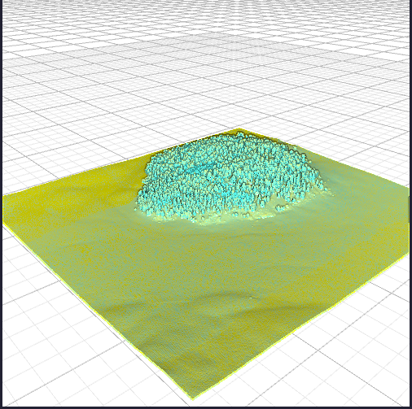
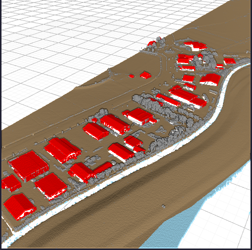
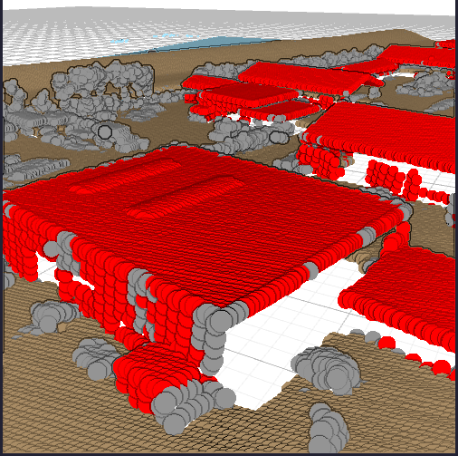
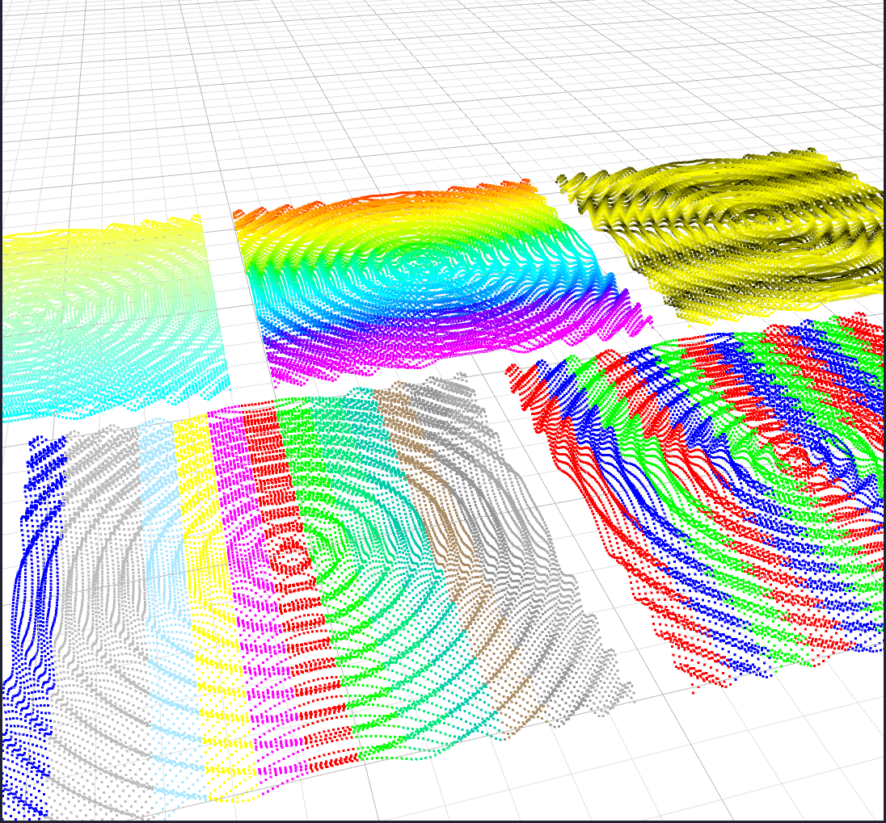

# Point Cloud Viewer

This crate provides an interactive viewer for point clouds, such as those captured by
terrestrial LiDAR scanners.

## Features

 - Compatible with the `pasture_core` crate.
 - Visualize arbitrary point attributes like classification or intensity.
 - Eye-Dome lighting.
 - Cross-platform: Works on Linux, macOS and Windows.

## Getting started

Have a look at the examples!

There are some tutorial-style examples, that explain all the concepts:

 1. [Render thread initialisation](examples/01_init.rs)
 2. [Window management](examples/02_window_management.rs)
 3. [Simple point cloud rendering](examples/03_simple_point_clouds.rs)
 4. [Visualizing point attributes](examples/04_point_attributes.rs)

If you just want a quick example for how to get a few points on the screen, 
have a look at the [getting started example](examples/getting_started.rs).

## Try out

```
# Careful, this point cloud is relatively large.
# It will need approximately 1GiB of memory.
wget -O points.laz https://download.pdok.nl/rws/ahn3/v1_0/laz/C_02CZ1.LAZ
INPUT_FILE=points.laz cargo run --example full_example_show_laz_file --release
```

## Screenshots






## ToDo

 - Other navigation modes
 - Option to show bounding boxes
